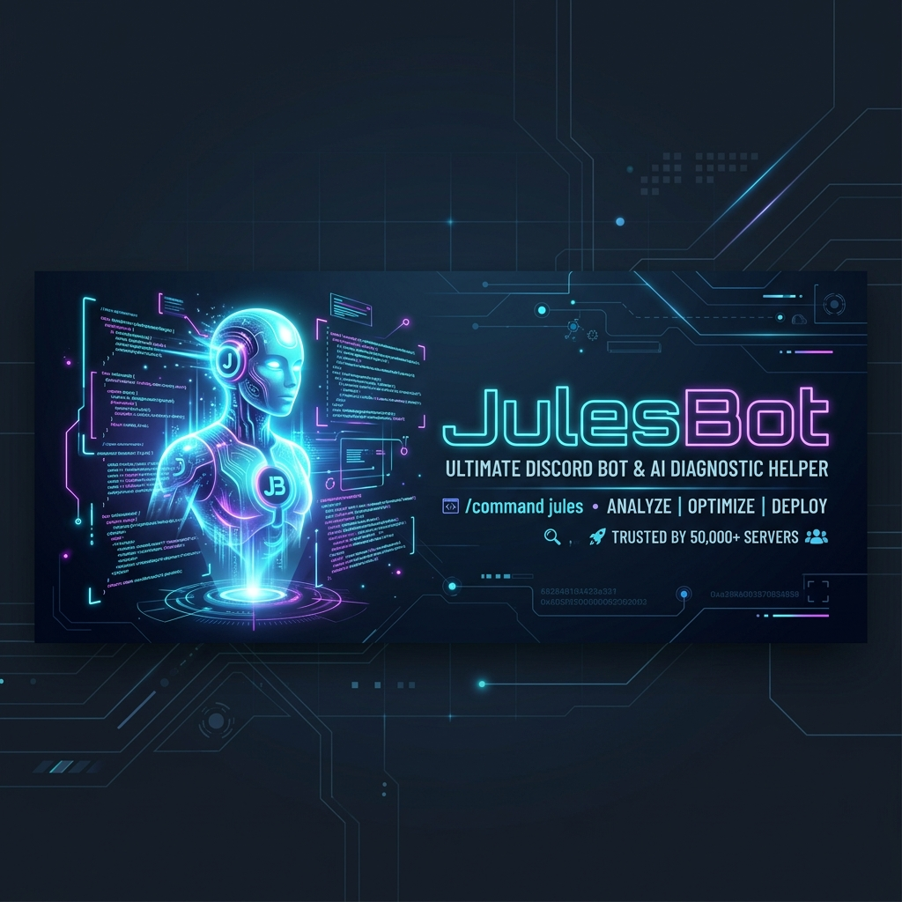

<p align="center">
  
</p>

<h1 align="center">🔮 JulesBot</h1>

<p align="center">
  <strong>Interactive Diagnostic Discord Assistant</strong>
</p>

<p align="center">
  <a href="https://discord.js.org/"></a>
  <a href="https://www.typescriptlang.org/"></a>
  <a href="https://www.prisma.io/"></a>
  <a href="https://www.sqlite.org/"></a>
</p>

<p align="center">
  JulesBot is a Discord bot designed to act as a <strong>friendly, interactive diagnostic helper</strong> for developers and non-technical stakeholders alike. Powered by the <strong>Google Jules SDK</strong>, it enables live conversations about your codebase inside Discord Forum channels.
</p>

---

## 🚀 The Triage Approach

Unlike standard AI coding agents that immediately modify code and rush to open Pull Requests, JulesBot focuses on **diagnostics first**:

```
[User Forum Post] ➔ [Init Jules Session] ➔ [Stream live steps in Status message] ➔ [Wait for Human Button Gate] ➔ [Diagnose/Fix]
```

1. 🗣️ **Clear Explanations**: Translates bugs and issues into simple terms with everyday analogies instead of programmer jargon.
2. ⚙️ **Real-Time Logs**: Streams live terminal outputs and step progress inside a single status message.
3. 🛑 **Interactive Gating**: Any proposed code adjustments are presented with interactive **Approve** and **Reject** buttons before execution.

---

## ✨ Features

* 📁 **Forum-to-Session Mapping**: Each forum post automatically initializes a unique interactive Google Jules session.
* ⚡ **Live Log Streaming**: Stream terminal executions and tools into a single status message without hitting Discord rate limits.
* 🛡️ **Access Control allowlists**: Allowlist commands and debug thread usage by User IDs, Role IDs, or toggle globally.
* 🔌 **Seamless Recovery**: Database-backed rehydration re-establishes streaming listeners on bot restarts or serverless pauses.
* 📝 **Custom Prompting**: Easily modify how the bot talks to your users by changing the prompt in `src/config.ts`.

---

## 🛠️ Setup & Run

### 1. Prerequisites
- **Node.js** (v18+)
- A Discord Application token with proper intents.
- A Google Jules API Key.

### 2. Configure Environment
Create a `.env` file in the root:
```env
DATABASE_URL="file:./prisma/dev.db"
DISCORD_TOKEN="YOUR_DISCORD_TOKEN"
JULES_API_KEY="YOUR_JULES_API_KEY"

# Access Controls (Optional)
ALLOW_ALL="true" # Set to "false" to enforce allowlisting
ALLOWED_USERS="123456789012345678" # Comma-separated user IDs
ALLOWED_ROLES="112233445566778899" # Comma-separated role IDs
```

### 3. Initialize Database
```bash
npm install
npm run db:migrate -- --name init
```

### 4. Start the Bot
```bash
# Run in development mode (hot reload)
npm run dev

# Run in production mode
npm run build
npm run start
```

---

## ⚙️ Discord Developer Portal Configuration

Ensure the following settings are enabled on your bot application page:
1. **Intents**:
   - `Message Content Intent` (Required to read forum posts and thread content)
2. **Permissions**:
   - `Read Messages/View Channels`
   - `Send Messages`
   - `Send Messages in Threads`
   - `Manage Messages` (Required to edit the status message)
   - `Use Slash Commands`

---

## 🕹️ Command Reference

| Command | Arguments | Permissions | Description |
| :--- | :--- | :--- | :--- |
| `/setup-forum` | `channel` (Forum) | `Manage Server` | Assigns the designated channel where Jules bot will spin up debug sessions. |
| `/link-repo` | `repository` (owner/repo) | `Manage Server` | Links a target GitHub repository to the server as the default codebase. |
